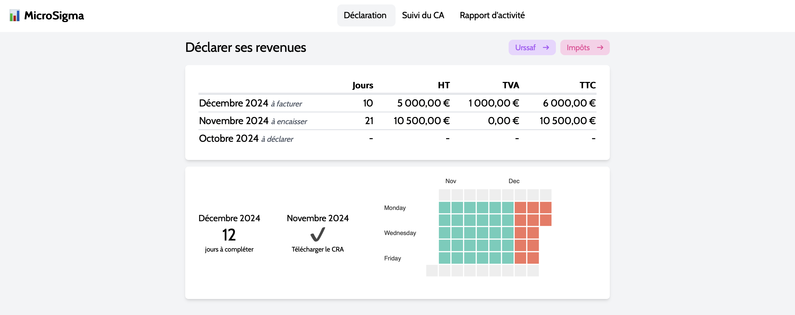

# 📊 MicroSigma

Simplifies tracking my self-employed activity (Micro-Entreprise). It allows me to:

- Log my workdays
- Track my revenue
- Calculate social contributions and income taxes
- Helps with invoicing and revenue declaration



### 🤖 AI powered

Don't need it, but it's trendy (and I wanted to play with PydanticAI)

```bash
❯ poetry run ai "how much I've earned since the beginning of the month"

sql_query="SELECT SUM(rate * real) AS total_earned FROM activity WHERE date >= DATE('2024-12-01') AND date <= DATE('2024-12-15')"
result='You have earned a total of 5500 euros since the beginning of the month.'
```

```bash
❯ poetry run ai "log a workday for yesterday"

Please provide the rate for the workday on 2024-12-14.: 500
sql_query="INSERT INTO activity (date, paid_at, rate, estimated, real) VALUES (DATE('now','-1 day'), DATE('now','-1 day'), 500, 1.0, 1.0)"
result='A workday has been successfully logged for 2024-12-14.'
```

```bash
❯ poetry run ai "delete all activity for the current month"

sql_query="DELETE FROM activity WHERE date >= DATE('now', 'start of month') AND date < DATE('now', 'start of month', '+1 month')"
result='15 rows deleted.'
```

## Getting Started

### Run the app

```bash
npm install
npm run dev
```

Open [http://localhost:8888](http://localhost:8888)

### Run the AI agent

```bash
cd src/ai
poetry install
OPENAI_API_KEY=xxx poetry run ai "prompt"
```

## Configuration

`./src/config.ts` _(may not be up to date)_

```typescript
{
  socialContributionRate: 0.22,
  acreRate: 0.11,
  acreStartDate: dayjs('2024-06-01'),
  acreEndDate: dayjs('2025-03-31'),
  incomeTaxRate: 0.18,
  taxAbatement: 0.34,
  activityStartDate: dayjs('2024-06-01'),
  incomeLimit: 77700,
  vatLowerLimit: 36800,
  vatUpperimit: 39100,
  vatStartDate: dayjs('2024-12-01'),
}
```

## TODO

- Generate activity report PDF (CRA)
- Notify when approaching the VAT threshold
- Update the configuration file directly from the interface
